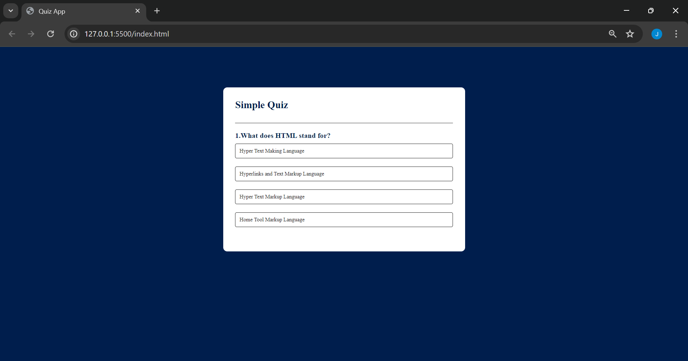
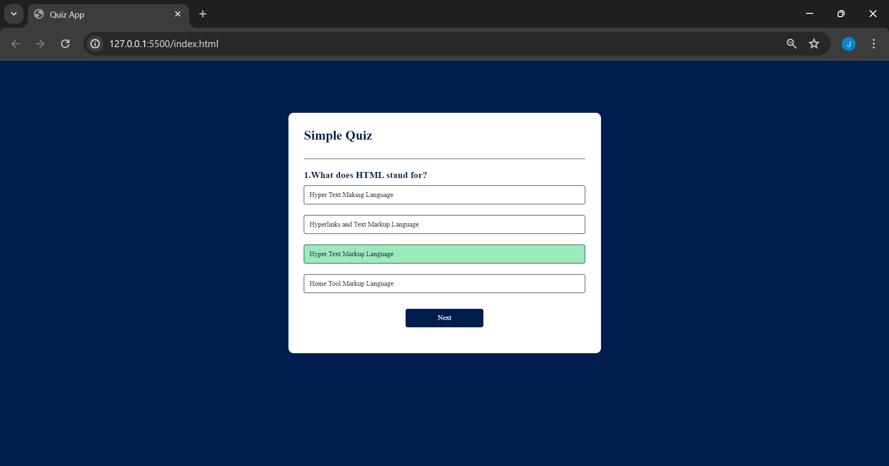
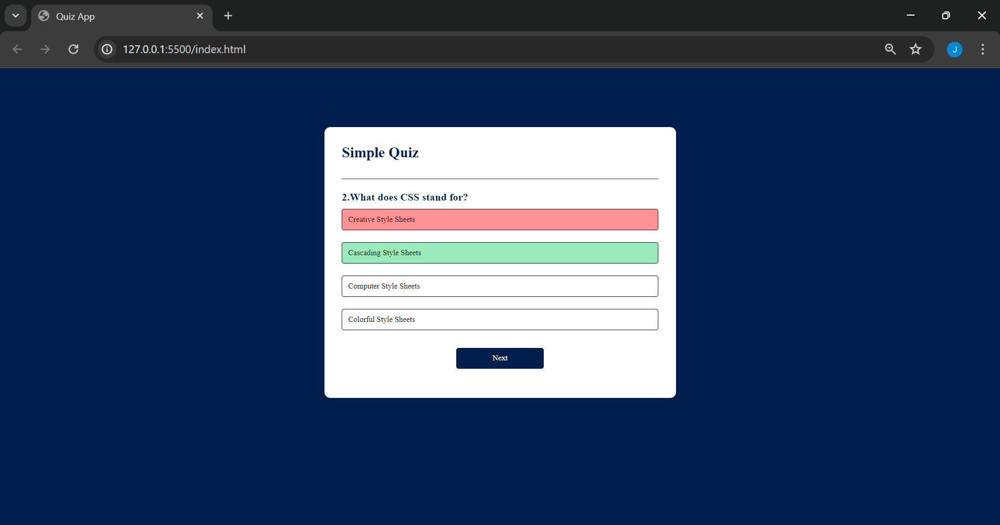
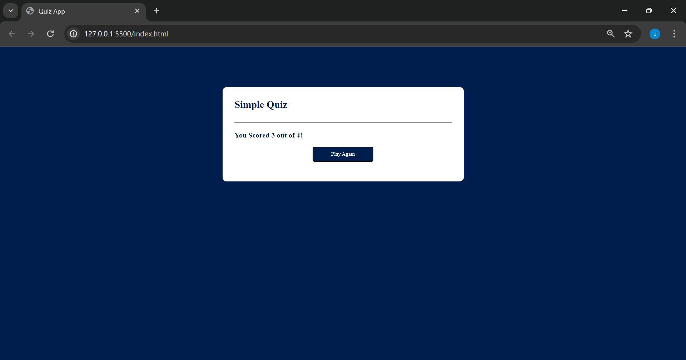

# QuizApp

This is a simple and interactive **Quiz App** built using **HTML, CSS, and JavaScript**. It displays multiple-choice questions, highlights correct and wrong answers, and shows your final score at the end.

## Features

- Displays one question at a time with four answer options
- Highlights incorrect answer in red and correct one in green
- Prevents changing answers after selection
- Next button to navigate through questions
- Final score display after quiz completion
- Play Again button to restart the quiz

## How It Works

1. The user selects an option from the four choices.
2. The app checks if the answer is correct or wrong.
3. Correct answer turns green, wrong one turns red.
4. Once selected, the answer cannot be changed.
5. After finishing all questions, the score is shown.
6. User can restart the quiz with the "Play Again" button.

 ## 🚀 Live Demo

🔗 [Live on GitHub Pages](https://jasnafathim.github.io/QuizApp/)

## Tech Used

- HTML  
- CSS 
- JavaScript

## Project Structure

1. `index.html` – HTML structure  
2. `style.css` – App styling  
3. `script.js` – Quiz logic and interactivity

## Screenshots

- **Dashboard**

   
- **Correct Answer**

   
- **Wrong Answer**

- **Score**

